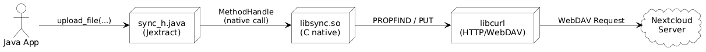

## File Synchronization mit jextract & libcurl

A Native Java Integration Projekt
Ostfalia University of Applied Sciences  
*Seminarvortrag – Sommersemester 2025*
##### Prof. Dr. Bernd Müller
###### Edin Fidoris

Note:
Hallo zusammen,  
ich freue mich, heute mein Projekt vorzustellen, bei dem ich mithilfe von **jextract** eine Brücke zwischen **Java** und **C** gebaut habe.

Im Zentrum steht eine kleine native Bibliothek, mit der ich Dateien direkt per **WebDAV auf meine Nextcloud** hochladen kann –  

Dabei ging es nicht nur um Technik, sondern auch darum, ein System zu schaffen, das **leichtgewichtig**, **schnell** und **gut wartbar** ist.

Ich zeige heute Schritt für Schritt, wie jextract funktioniert, wo seine Stärken liegen –  
und auch, an welchen Stellen es (noch) an Grenzen stößt.


---

## Inhaltsverzeichnis

1. Motivation & Ziel
2. Architektur & Komponenten
3. Die Rolle von jextract
4. Native Bindings & Code-Generierung
5. Einschränkungen & Fallstricke
6. Fazit & Ausblick

Note:
In dieser Präsentation führe ich euch durch mein Projekt zur nativen Interaktion zwischen Java und C mit jextract.  

Wir beginnen mit der Motivation, schauen uns die Architektur an, steigen dann in jextract ein,  
und besprechen die praktischen Erfahrungen – inklusive Herausforderungen.  

Zum Schluss gibt’s ein Fazit und einen kurzen Ausblick, wohin es noch gehen kann.

---

## Motivation & Problemstellung

- ich wollte Dateien zwischen meinem Android-Gerät und meiner Nextcloud automatisch synchronisieren
- Java hat WebDAV-Clients wie Sardine – aber: oft unvollständig oder unzuverlässig
- libcurl ist robust und unterstützt WebDAV vollständig – aber nur in C
- Ziel: libcurl einfach aus Java nutzen – ohne JNI
- Lösung: jextract + Foreign Function API


Note:
Meine ursprüngliche Motivation war sehr konkret:

Ich wollte ein eigenes Tool bauen, um **Dateien zwischen meinem Android-Gerät und meiner selbst gehosteten Nextcloud** automatisch zu synchronisieren.

Ich habe mir die existierenden Java-Bibliotheken wie Sardine angeschaut – aber dabei schnell gemerkt:
 - das könnte ich selbst bauen
 - und eventuell daraus was lernen

 da habe ich die curl Bibliothek rausgesucht da es eine leistungsfähige C-Bibliothek ist, die WebDAV vollständig unterstützt und sehr stabil läuft.

Mit jextract dachte ich erstmal könnte ich versuchen die header Dateien zu parsen.
Das Ergebnis: Ich konnte aus Java direkt mit libcurl kommunizieren und so mein Ziel umsetzen – eine funktionierende Dateisynchronisation zwischen meinem System und meiner Nextcloud.

---


## Ziel & Lösungsansatz

- Ziel: C-Funktionen (z. B. libcurl) **einfach aus Java verwenden**
- Lösung: **jextract** generiert Java-Bindings automatisch aus C-Headern
- Ergebnis: Ein Service der die Dateien synchronisiert mit einer lokalen Nextcloudinstanz die auf dem Raspberry Pi in k3s läuft

Note:

Meine Hoffnung: Ich schreibe eine einfache C-Header-Datei, in der ich meine Funktionen wie `upload_file(...)` deklariere –  
und jextract erstellt mir daraus automatisch eine saubere Java-API.

Spoiler Alert:
Das hat funktioniert. Ich musste kein JNI schreiben, keine nativen Wrapper pflegen –  
sondern konnte direkt aus Java über `MemorySegment` mit meiner nativen C-Bibliothek kommunizieren.

Das Ergebnis ist ein funktionierender Java-Service, der Dateien zuverlässig auf meine Nextcloud hochlädt –  
die Nextcloud läuft in einem leichtgewichtigen Kubernetes-Cluster (K3s) auf einem Raspberry Pi.

Das Setup ist komplett lokal, datenschutzfreundlich – und genau auf meine Bedürfnisse zugeschnitten.


---
## Was ist jextract?

- Teil des Panama-Projekts (Java FFI)
- Generiert Java-API aus C-Header-Dateien
- Nutzt `libclang`, um Typen und Signaturen korrekt zu parsen
- Ergebnis: idiomatische Java-Klassen

Note:
jextract gehört zum Panama-Projekt, das Java direkten Zugriff auf nativen Code ermöglichen soll – ohne JNI.  

Statt händisch JNI zu schreiben, übernimmt jextract das: Es parst die Header mit libclang und erzeugt sofort nutzbare Java-Klassen.  

Dazu gehören Funktionen, Structs, Enums usw.

---
## sync.h → Sync.java

```c {highlightLines="2"}
  // sync.h
  #ifndef SYNC_H
  #define SYNC_H

  void upload_file(const char* path, const char* target_url);
  int list_folders(const char* remote_url, const char* username, 
                            const char* password);

  #endif
```
Note:
Hier sehen wir den Header sync.h, den ich für meine Anwendung geschrieben habe.

Er enthält 6 native Funktionen: Hier zeige ich nur eine zum Hochladen von Dateien per libcurl, und eine zum Abfragen von Verzeichnissen via PROPFIND

Das Besondere ist: Dieser Header ist so geschrieben, dass jextract ihn ohne Probleme verarbeiten kann – also nur C-Standardtypen, keine Makros, keine Pointer-Arithmetik, kein komplexes Preprocessing.
Genau das braucht jextract, um eine Java-API daraus zu generieren.

---

## Generierung der Java-Bindings

```bash
# Kompilieren der C-Bibliothek (libsync.so)
clang -shared -fPIC -o libsync.so sync.c -lcurl -lxml2

# jextract erzeugt Java-Bindings aus sync.h
jextract \
  --library sync \
  -I include/ \
  --use-system-load-library \
  --output src/main/java \
  --target-package com.nativecloud.sync \
  include/sync.h
```

Note:
Diese Folie zeigt den vollständigen Build-Prozess: Wie aus C-Code eine nutzbare Java-API entsteht.

Zuerst wird mit clang die native Bibliothek libsync.so erzeugt.
Das -shared-Flag erzeugt eine dynamische Bibliothek (Shared Library), -fPIC macht sie positionsunabhängig.
Zusätzlich wird gegen libcurl und libxml2 gelinkt, weil mein Code HTTP- und XML-Funktionen nutzt – etwa für PROPFIND.

Wichtig zu wissen: jextract **kompiliert keinen Code** und benötigt **die `.so`-Datei selbst nicht**.  
Es analysiert ausschließlich den Header `sync.h`.

Der zweite Block zeigt den jextract-Aufruf.
Dieser analysiert die Header-Datei sync.h und erzeugt automatisch Java-Bindings.
Wichtig sind dabei folgende Optionen:

--library sync: Der Name der nativen Bibliothek (ohne lib und .so), also z. B. libsync.so unter Linux.
Unter Windows müsste die Datei z. B. sync.dll heißen. Die Plattform entscheidet, wie der Name intern aufgelöst wird.

--use-system-load-library: Sorgt dafür, dass später System.loadLibrary("sync") funktioniert – etwa wenn die .so oder .dll im java.library.path liegt.

-I include/: Gibt den Pfad zur Header-Datei an – notwendig für korrekte Typauflösung durch libclang.

--output und --target-package: Bestimmen Zielverzeichnis und Java-Paket für die generierte Klasse (z. B. com.nativecloud.sync.sync_h).

Plattformunterschiede beachten:
Unter Linux muss die Bibliothek libsync.so heißen.
Unter Windows wäre der Name z. B. sync.dll, und jextract würde automatisch System.loadLibrary("sync") verwenden – ohne Präfix.

Die erzeugte Java-Klasse enthält Methoden wie upload_file(...), die intern mit MemorySegment und MethodHandle arbeiten – ganz ohne JNI.

Wenn man das systemübergreifend einsetzen will (Linux + Windows), sollte man verschiedene Builds für .so und .dll erzeugen – oder den genauen Library-Pfad zur Laufzeit setzen.

Kurz zur positionunabhänigkeit
Normaler Code hat feste Adressen („absolute Adressierung“).
→ z. B. mov eax, [0x00401000]
Das funktioniert nur, wenn der Code genau dort im Speicher liegt.
Positionunabhängiger Code (PIC, position-independent code) verwendet relative Adressen
→ z. B. mov eax, [ebx + offset]
 Dadurch ist der Code flexibler, weil er egal wo im Speicher geladen werden kann.

 Warum ist das wichtig?
Für Shared Libraries wie libsync.so:
Mehrere Programme können dieselbe .so verwenden.

Das Betriebssystem lädt sie an beliebige Speicheradressen.

Dafür muss der Code positionunabhängig sein.

Das wird mit dem Compiler-Flag -fPIC aktiviert.
---
## Die Rolle von Clang

- jextract ist kein eigener Compiler
- Es nutzt **Clang**, um C-Header-Dateien zu analysieren
- Clang verarbeitet Includes, Typen, Makros und erzeugt eine **AST**
- Diese AST ist die Grundlage für die generierten Java-Bindings

Note:
Clang hat zwei wichtige Funktionen 
Erstens nutze ich Clang als ganz normalen C-Compiler, um aus meinem C-Code die Bibliothek `libsync.so` zu erstellen – ohne diese Datei würden die generierten Java-Bindings ins Leere laufen.  
Zweitens verwendet jextract intern `libclang`, also die Clang-Bibliothek, um meine Header-Dateien zu analysieren. Dabei wird kein Code kompiliert, sondern nur die Struktur und die Typen des C-Headers ausgelesen.  
Ohne Clang – oder eine korrekt installierte `libclang`-Umgebung – funktioniert jextract nicht.  
Es ist also ein technischer Schlüsselbestandteil im Hintergrund, auch wenn ich es nicht direkt aufrufe.

---

## Das Ergebnis: Automatische Java-API

- Automatisch erzeugt durch jextract aus dem Header sync.h
- Für jede C-Funktion entsteht eine Java-Methode
- Übergabe erfolgt über MemorySegment (sicherer Zugriff auf nativen Speicher)
- Methoden verwenden intern MethodHandle zum direkten Aufruf der nativen .so
- Die .so-Datei **libsync.so** muss zur Laufzeit verfügbar sein – wird nicht von jextract benötigt

Note:
Nach dem Aufruf von `jextract` entsteht z. B. die Datei `sync_h.java`, die Methoden wie `upload_file(...)` enthält.
Diese Methoden spiegeln direkt die Signatur der C-Funktionen aus `sync.h` wider – allerdings in Form von `MemorySegment`-Parametern.

Das ist Teil des Foreign Function & Memory API von Java, das direkten und sicheren Zugriff auf nativen Speicher erlaubt – z. B. für Strings, Structs oder Arrays.
Der eigentliche Aufruf läuft intern über einen `MethodHandle`, der zur Startzeit erzeugt wurde und auf die Funktion in `libsync.so` zeigt.

Wichtig: `jextract` benötigt die `.so` nicht – sie muss aber **zur Laufzeit** von Java über `System.loadLibrary("sync")` gefunden werden.

---

## Beispiel: Generierte Methode


```java
//Sync.java (automatisch generiert)
public static int upload_file(MemorySegment local_path, MemorySegment nextcloud_url, 
MemorySegment username, MemorySegment password) {
    var mh$ = upload_file.HANDLE;
    try {
        if (TRACE_DOWNCALLS) {
            traceDowncall("upload_file", local_path, nextcloud_url, 
                                    username, password);
        }
        return (int)mh$.invokeExact(local_path, nextcloud_url, 
                                username, password);
    } catch (Throwable ex$) {
       throw new AssertionError("should not reach here", ex$);
    }
}
```

Note:
Was wir hier sehen, ist eine von jextract **automatisch generierte Methode** in Java.

Die Methode `upload_file(...)` entspricht direkt der gleichnamigen Funktion in C –  
aber: Statt normaler Strings verwendet sie `MemorySegment`, also direkten Speicherzugriff.

Wichtig ist die Zeile `var mh$ = upload_file.HANDLE`:  
→ Das ist ein sogenannter `MethodHandle` – ein Zeiger auf die C-Funktion in `libsync.so`.  
→ Dieser Zeiger wurde zur Startzeit über das Foreign Function & Memory API gesetzt.

Mit `mh$.invokeExact(...)` wird die C-Funktion **direkt** aufgerufen –  
das ist wie ein „native call“ aus Java, ganz ohne JNI oder Wrapper.

Wenn `TRACE_DOWNCALLS` aktiviert ist, kann man alle Parameter und Aufrufe zur Laufzeit mitloggen –  
praktisch fürs Debugging.

**Fazit:** Diese Methode ist ein direkter Brückenschlag von Java zu C –  

---

## Integration in Quarkus


```java
// Quarkus-REST: Datei-Upload mit native Aufruf
@Path("/upload")
@POST
@Consumes(MediaType.MULTIPART_FORM_DATA)
public Response uploadFile(@MultipartForm UploadForm form) {
    try (Arena arena = Arena.ofConfined()) {
        var file = arena.allocateUtf8String(form.filePath);
        var url  = arena.allocateUtf8String(form.targetUrl);
        var user = arena.allocateUtf8String(form.username);
        var pass = arena.allocateUtf8String(form.password);
        int res = sync_h.upload_file(file, url, user, pass);
        return Response.ok("Upload result: " + res).build();
    }
}
```
Note:
In meinem Projekt habe ich die durch jextract generierte Java-Klasse `sync_h` in einen REST-Service mit **Quarkus** integriert.

**Was ist Quarkus?**
Quarkus ist ein modernes Java-Framework, das speziell für Container, Cloud und Microservices entwickelt wurde.  
Es startet extrem schnell, hat einen sehr niedrigen RAM-Verbrauch und bietet direkten Support für REST, Dependency Injection und Native Builds.

**Warum habe ich es gewählt?**
- Sehr schneller Start – ideal für kleine Tools oder Services auf dem Raspberry Pi
- Minimaler Speicherbedarf – besonders wichtig bei Embedded-Systemen
- Einfache Integration von REST + Java-Bindings
- Gute Developer Experience (Hot Reload, Dev-UI)

In meinem Fall: Ich wollte eine REST-Schnittstelle bereitstellen, die eine Datei empfängt und sie über `libcurl` hochlädt – und das möglichst schlank.  
Quarkus war dafür perfekt geeignet.

---

## Java ruft C auf – mit MemorySegment

```java
@ApplicationScoped
public class NextcloudNativeClient {
    public int upload(String localPath, String remoteUrl, String username, String password) {
        try (Arena arena = Arena.ofConfined()) {
            MemorySegment local = arena.allocateUtf8String(localPath);
            MemorySegment remote = arena.allocateUtf8String(remoteUrl);
            MemorySegment user = arena.allocateUtf8String(username);
            MemorySegment pass = arena.allocateUtf8String(password);

            return upload_file(local, remote, user, pass);
        }
    }
}
```
Note:
Diese Methode ist der Java-Wrapper, der die generierte native Methode `upload_file(...)` komfortabel aufruft.

Warum habe ich das gemacht?

Die Methode `upload(...)` ist eine komfortable Brücke zwischen normalem Java-Code (Strings) und der nativen Welt (`MemorySegment`).

Ich übergebe hier ganz normale Java-Strings (z. B. Dateipfad, URL, Login-Daten).  
Mit `arena.allocateUtf8String(...)` werden sie in native Speicherbereiche umgewandelt – das ist nötig, weil die C-Funktion echte C-Strings erwartet.

`Arena.ofConfined()` sorgt dafür, dass dieser Speicher **automatisch** wieder freigegeben wird – ich muss mich also nicht selbst um Speicherverwaltung kümmern.

Anschließend wird die generierte Methode `upload_file(...)` aus `sync_h` aufgerufen – sie nutzt intern einen `MethodHandle`, um direkt die native Funktion in `libsync.so` auszuführen.

So kann ich aus normalem Java heraus mit wenigen Zeilen Code eine Datei nativ über libcurl hochladen.

---

## Ergebnis: Funktionierender Dateiupload

- Upload von Dateien zu Nextcloud über C + libcurl
- Aufruf aus Java über jextract-Bindings
- Läuft lokal und auf dem Raspberry Pi

Note:
Was ist das konkrete Ergebnis?

Ich habe eine Java-Anwendung entwickelt, die beliebige Dateien lokal hochladen kann –  
dabei wird im Hintergrund eine native Bibliothek in C verwendet, die `libcurl` nutzt, um die Datei per WebDAV zu übertragen.

Die Besonderheit:
→ Die Anwendung läuft **lokal auf meinem Rechner**,  
→ aber die Ziel-Nextcloud ist **nicht lokal**, sondern läuft auf einem **Raspberry Pi**,  
→ und zwar innerhalb eines **K3s-Clusters** – also einem leichtgewichtigen Kubernetes.

Das heißt: Ich habe hier ein echtes Client-Server-Setup realisiert –  
mit einem lokal laufenden Upload-Service und einer virtuelen Nextcloud im Netzwerk.

Damit habe ich bewiesen, dass mein Ansatz nicht nur technisch funktioniert, sondern auch in verteilten Umgebungen einsetzbar ist – sogar auf embedded Hardware wie dem Pi.

---

## Architektur



- Java-Code ruft `sync_h.upload_file(...)`
- jextract leitet Aufruf an `libsync.so` weiter
- libsync.so nutzt `libcurl` für HTTP/WebDAV
- Ziel ist z. B. eine Nextcloud-Instanz

Note:
Dieses Architekturdiagramm zeigt den kompletten Ablauf meiner Anwendung – von Java bis zur Nextcloud-Instanz.

1. **Java-Code** ruft die Methode `upload_file(...)` auf, die automatisch durch jextract generiert wurde.  
   → Die Parameter sind `MemorySegment`s – also native Speicherbereiche, nicht normale Strings.

2. Die generierte Methode verwendet einen `MethodHandle`, der bei Programmstart automatisch gesetzt wurde.  
   → Dieser `MethodHandle` ist ein direkter Zeiger in die geladene Bibliothek `libsync.so`.

3. **libsync.so** ist meine eigene native Bibliothek, die ich mit oder `clang` kompiliert habe.  
   → Sie enthält die eigentliche Upload-Logik in C, die `libcurl` verwendet.

4. **libcurl** übernimmt den HTTP-Teil, inklusive WebDAV-Erweiterung.  
   → Das bedeutet, ich kann beliebige WebDAV-Kommandos wie `PUT`, `PROPFIND` usw. absetzen.

5. Am Ende erreicht die Datei meine **Nextcloud-Instanz**, die im Heimnetz auf einem **Raspberry Pi im K3s-Cluster** läuft.

Das Besondere hier:  
 Kein JNI, keine Wrapperklassen, kein komplizierter nativer Code auf Java-Seite.  
 jextract + Foreign Function API übernimmt alles – performant und sicher.

Diese Architektur zeigt, dass Java heute **direkt mit nativen C-Bibliotheken kommunizieren kann** – ohne die alten Probleme von JNI – und das eignet sich auch für produktionsnahe Anwendungen wie Synchronisation, Monitoring oder Embedded-Systeme.

„Da Nextcloud auf meinem Raspberry Pi lokal läuft, aber ich externen Zugriff für den Sync-Service brauche, nutze ich cloudflared als sicheren Tunnel. So kann ich z. B. über https://nextcloud.edinf.dev per libcurl hochladen – ohne VPN oder Portweiterleitung.“

---

## Einschränkungen von jextract

- **Funktions-Makros** wie `#define MIN(a,b)`  
  → werden **ignoriert**, keine Java-Methode
- **Bitfields** in `structs`  
  → werden **übersprungen**, keine Feld-Extraktion

Note:
Auch wenn jextract sehr mächtig ist, stößt man bei der praktischen Arbeit schnell auf ein paar Grenzen.  
Gerade bei nativen C-Headern, wie man sie oft in älteren Bibliotheken oder Systemkomponenten findet, kommen Features vor, die jextract aktuell nicht verarbeiten kann.

Ich zeige euch zwei typische Beispiele, die mir während der Entwicklung selbst begegnet sind – und wie ich damit umgegangen bin.

---
### Funktions-Makro

```c
#define MIN(a, b) ((a) < (b) ? (a) : (b))
```
##### Alternative
```c
int min_int(int a, int b) {
    return (a < b) ? a : b;
}
```

Note:
Makros wie `#define MIN(a,b)` sind zur Compile-Zeit nur Text-Ersetzungen.  
Sie werden vom C-Preprocessor ersetzt, **bevor** Clang oder jextract den Code überhaupt sieht.

jextract arbeitet nicht mit diesem „ersetzten“ Code, sondern direkt mit dem Original-Header –  
also mit der **strukturhaften Repräsentation** des Codes, nicht mit Text.

Daher sieht jextract kein `MIN(a,b)` – es gibt für jextract keine Funktionssignatur, keinen Typ, keine Parameterliste.

Die Lösung ist: Ich schreibe einfach eine **echte C-Funktion**, wie `int min_int(...)`,  
dann kann jextract daraus eine Java-Methode generieren – inklusive Typprüfung, `MethodHandle` usw.

---

### Bitfields

```c
struct Flags {
    unsigned int read  : 1;
    unsigned int write : 1;
    unsigned int exec  : 1;
};
```
*Ausgabe: Skipping Flags.read (bitfields are not supported)*

##### Alternative
```c
struct Flags {
    unsigned int read;
    unsigned int write;
    unsigned int exec;
};
```

Note:
Bitfields sparen Speicher, sind aber plattformabhängig im Layout. jextract überspringt sie, weil das Layout nicht garantiert nachgebildet werden kann. Nutze lieber einfache int-Felder, wenn du plattformunabhängig arbeiten willst.

---

[Demo](https://www.youtube.com/watch?v=1ugKw5oYIYM)

---

## Herausforderungen

- C code muss sehr strikt nach angaben von jextract definiert werden
- WebDAV quirks (e.g., PROPFIND) benötigt low-level handling
- Containerisierug von libsync.so war nicht trivial

Note:
In diesem Projekt war es entscheidend, den C-Code so zu schreiben, dass jextract ihn überhaupt verarbeiten kann.  
Das heißt: keine Makros mit Logik, keine Bitfields, keine undurchsichtigen Structs.

Ein zweiter Punkt war der Umgang mit WebDAV – speziell der PROPFIND-Request ist sehr speziell und wird von den meisten High-Level-Clients nicht richtig unterstützt. Deshalb musste ich direkt mit libcurl arbeiten und z. B. die XML-Antwort manuell verarbeiten.

Daher habe ich entschieden, die Bibliothek **zuerst lokal zu testen** – und die Containerisierung erst dann zu machen, wenn das was wichtig ist erstmal gut läuft.


---

## Fazit & Ausblick

- jextract ermöglicht effiziente und sichere Interop zwischen Java und C-Libraries
- Ideal für Systemintegration mit Performance-Anforderungen
- Projekt hat Spaß gemacht und praxisnah viele Herausforderungen gezeigt
- jextract ist nutzbar aber low-level C soll sauber und gut definiert sein
- "Echtzeitsync" mit Raspberry-Pi funktioniert sehr gut mit kleinen Dateien
- Nächstes Ziel: Dateisynchronisation zwischen Geräten mit ZeroMQ + Nextcloud

Note:
Dieses Projekt war für mich nicht nur technisch spannend, sondern hat auch richtig Spaß gemacht.  
Ich habe tief in die Welt von jextract und dem Foreign Function & Memory API eingetaucht und dabei gesehen, wie sauber und performant native Interop heute sein kann – ganz ohne JNI.

Besonders motiviert hat mich ein persönlicher Moment: Ich wollte automatische Datei-Uploads von meinem Handy zu Nextcloud einrichten – aber Google blockiert diese Funktion aktiv.  
Das war der Moment, wo ich dachte: „Okay – ich baue es eben selbst.“

Daraus entstand mein eigener nativer Dateisynchronisationsdienst mit libcurl, jextract und Quarkus – der nächste Schritt wird die asynchrone Kommunikation mit ZeroMQ sein, um mehrere Geräte zu vernetzen.

---

## Fragen

#### Vielen Dank für Ihre Aufmerksamkeit!

<div align="center">
  
  <br/>
  <em>Scan zum Repository</em><br/>
  <a href="https://gitlab.com/aebyss/jextract-nextsync</a>
</div>

